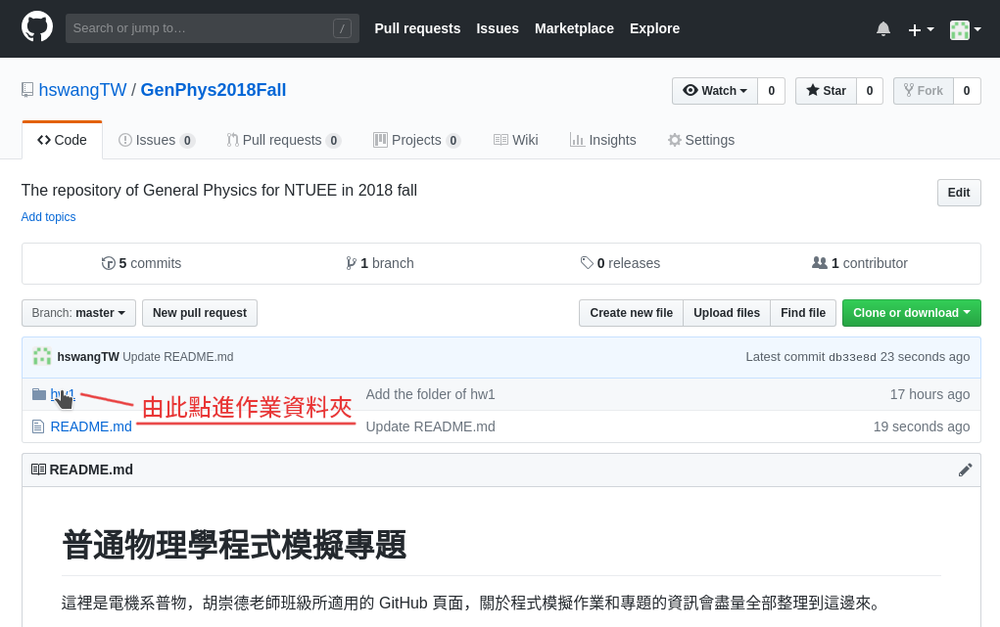

# 普通物理學程式模擬專題

這裡是電機系普物，胡崇德老師班級所適用的 GitHub 頁面，關於程式模擬作業和專題的資訊會盡量全部整理到這邊來。

## 如何使用這個頁面

由於一時沒想到更好的方式來呈現這些說明，所以助教就選用了 GitHub 了。這個位在根目錄的主頁面會放關於整個課程的說明，至於各次作業的詳細說明，會放到對應的資料夾裡面，請從上方點進對應的資料夾就行了。進入資料夾後，便會出現作業說明。

↑↑↑順手截了個圖↑↑↑

# 以下內容有待更新

## 作業要求與評分方式

本學期將會有五次程式作業、沒有期末專題，程式作業部份佔學期成績 ??% 。作業會在 CEIBA 和這裡公布，助教也會寄信通知大家。

### 一、作業（10% ，最高 11.25%）

> #### 12/04 更新
> 由於作業減少為七次，作業分數將會直接乘以 9/7 計算。
> 另外，影片部份開放在 12/16 前，可以補交之前作業的影片不算遲交，但不得超過兩部，請同學直接將要補交影片連結一次寄給我。在 12/16 後補交者，則繼續適用遲交規定（僅能作 0.5 部影片計算）。

作業原則上可以分成兩個部份：

#### （一）程式作業
請各位在看完石明豐老師的講課影片後，照作業說明文件中的要求，準時在CEIBA作業區繳交能夠正常運行的程式碼（py檔）。每次作業都會有必作（must）和選作（optional）部份，選作部份原則上必須在九次作業中完成其中四次，多出來的則作為加分使用，詳見下方的配分說明。

#### （二）說明影片
除了程式碼之外，老師還要求各位必須從九次作業中挑選四次拍攝說明影片，請同學們當作是自己在教課一般，在影片中說明：

1. 作業的物理意涵
2. 自己的程式如何運作

將影片上傳到YouTube（可以設成不公開但不能設成私人），並把影片連結張貼在CEIBA討論看板上對應的看板裡（詳見討論看板上的範例）。

拍攝影片是老師非常看重的部份，他希望同學們不只能夠撰寫出程式，還要同時能了解其中的物理，以及如何讓他人理解自己的程式運作。所以如果繳交的影片不足4部，處罰也會比較重一些（詳見下方配分說明），但是只要影片有說明到上述兩點，其餘部分便不會過份要求同學，各位就盡力展現自己最好的一面吧！

#### ＊配分規則說明

* **必作（must）部份（9%）**  
  此部份只需要準時繳交且正確完成必作部份即可，一次作業佔學期成績 1 分，九次作業共佔 9 分。遲交者若在期限後三天內繳交者，分數打八折，**超過三天則不接受繳交**。

* **選作（optional）部份（2.25%）**  
  準時繳交且正確完成選作部份者，一次作業可加0.25分。加分超過 10 分的部份，依然可以算入學期總分。遲交者同樣在三天內打八折，**超過三天不接受繳交**。

* **說明影片（-4% ~ 0.8%）**  
  （從作業二開始）各作業的影片連結需包含在壓縮檔內，和程式碼一起繳交，至期末不足四部影片者，**每少一次作業的影片扣作業總分 1 分**。逾期繳交的影片**僅能充當 0.5 次**，也就是遲交的影片兩次才能抵一次作業。從作業二之後，影片可以從 must 和 optional 中擇一講解，但兩部份都有講解的話，該次作業會額外加 0.1 分。

#### ＊抄襲處置（重要）

作業被發現抄襲者，**該次作業直接以0分計**。同學們當然可以討論作業該怎麼寫，但討論完之後請還是務必自己動手寫完程式，在寫的過程中自己把邏輯再跑過一次，這樣才能真的從作業學到東西。而且抓抄襲的程式、方法真的**非常地多**，批次處理起來省時省力，請同學們不要輕易挑戰。

### 二、專題（10%）

詳細規定請見[這裡](FinalProject.md)。

#### 繳交期限
`2018/12/31 MON 21:00`

## 環境設置

**環境要求：Python 3 + VPython 7**  

沒在自己電腦安裝過 Python 3 的人，很推薦直接安裝 Anaconda ，它包含了很多日後各位可能用到的套件（numpy, matplotlib, scikit-learn, etc.)、Python 的虛擬環境、還有 Jupyter notebook 這個有趣好用的工具等等。若是電腦裡已經有 Python 3 的話就沒那麼推薦了，一不小心就會把 Python 環境搞得一團亂。

* **Anaconda + VPython 安裝教學**  
  Windows: https://tinyurl.com/ydxwkm5f   
  Mac: https://tinyurl.com/y7y9aj5o (    不含 VPython)  
  （在Mac使用Anaconda安裝Vpython，請在terminal輸入`conda install -c vpython vpython`。）
  
* **普通的 Python 3 + VPython 安裝教學**  
  Windows: https://tinyurl.com/ya7g9wyw (記得是安裝Python 3）  
  Mac: https://tinyurl.com/y7jkpbyo
  
## 網站資源

* **VPhysics:** https://tinyurl.com/yb9pu62o  
  石明豐老師直接管理的網站，上面有安裝說明和一些簡單介紹，由於是老師直接管理，所以這裡的作業內容更新是最快的。
  
* **VPython Documentation:** https://tinyurl.com/ybheq4md  
  寫得不怎麼好的 Documentation ，但基本上這個套件各項用法的官方說明都在這裡了，只是真的不太好找。（說不定你們很能理解他的邏輯也不一定）
  
* **VPython User Forum:** https://tinyurl.com/hw8eu68  
  只要用 Google 帳號點選加入 group 就可以在上面發問，會有專家回應。

## 關於螢幕錄影

螢幕錄影方法的補充請看[這邊](ScreenRecord.md)。

## 聯絡助教

* 負責助教: 物理碩一 王涵聖
* 聯絡信箱: r07222060@ntu.edu.tw

基本上這個頁面和各位的作業都是由我負責的，有關這門課程式作業、或是有些 Python 的問題都歡迎寄信來問我。安裝的時候如果遇到什麼問題，除了 Mac 比較沒辦法回答之外（我可以幫你問其他助教），Windows 跟 Linux（尤其 Ubuntu 系列跟 Arch）我也都可以盡量幫忙解決。
