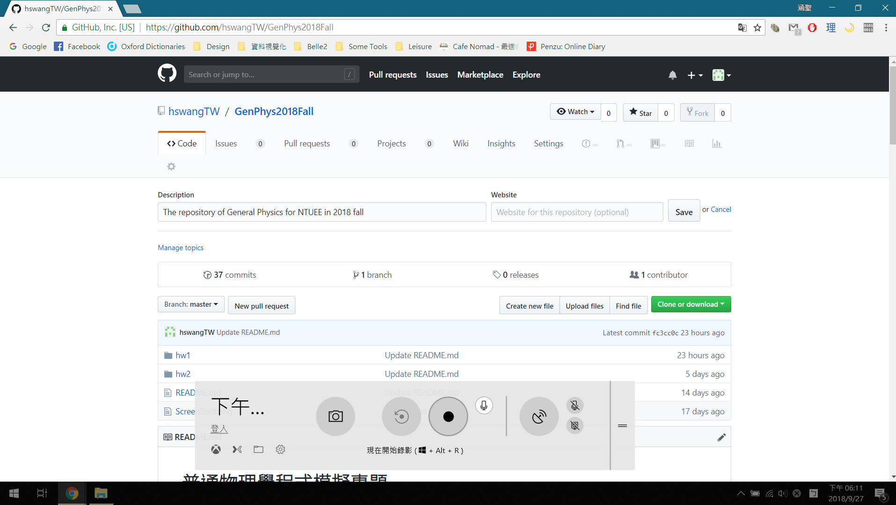

# 關於作業影片和螢幕錄影

因為有同學反應沒有拍過影片，不知道要怎麼拍，所以我就簡單整理了一下螢幕錄影的方式給大家。

## Windows 10 內建螢幕錄影

Windows 10 有自己內建螢幕錄影功能，但因為設計上這個功能是用來錄遊戲畫面用的，所以只能錄下單一視窗的畫面，如果螢幕中有好幾個視窗的話沒辦法全部錄下來。遇到要錄好幾個視窗的情況，就只能先分開錄再剪在一起了。

Windows 7/8 以下的系統雖然有內建類似工具，不過應該沒辦法錄製麥克風的聲音（不確定，手邊只有 windows 10），所以就不提了，使用這些系統的同學請往下看其他軟體。

### 如何使用

1. 在希望錄製的視窗按下 Win + G ，這時會跳出個小視窗問你要開啟遊戲列嗎，這時候選擇「是，這是遊戲」。

2. 接著就可以開始錄影啦，在錄影鍵的右上角有個小按鈕讓你開啟麥克風，就可以一邊錄螢幕一邊講話了。

## Mac 內建螢幕錄影

Mac 內建的 QuickTime Player 就有錄影功能了，但是我本身沒有 Mac ，所以只能貼教學文給你們了。（現在才發現上面連 windows 都寫得一應俱全……）

教學: https://www.ragic.com/intl/zh-TW/blog/175

## Bandicam 免費版

Windows 適用的螢幕錄製工具，免費版沒有限制天數也沒限制次數，但是影片最多就是只能錄 10 分鐘。嘛，在這個時代，後製是可以解決很多事情的。(X)

官方網站: https://www.bandicam.com/tw/

### 如何錄製麥克風

防呆的補充說明，想要錄製麥克風的話，請先點選新增麥克風（在HDMI圖案的按鈕右邊）

然後在次要音效裝置的地方選擇你的麥克風。

## Icecream Screen Recorder 免費版

只是試過了之後覺得很有趣就放了上來，比 Bandicam 還慘的是免費版只能錄五分鐘，但是它有個很有趣的功能就是可以在螢幕上畫畫，所以還是放了上來讓大家參考。

## 關於影片後製（剪輯）

如果同學想要把自己講錯的部份剪掉、把用icecream錄的好幾個 5 分鐘影片拼接起來、或是把錄音時的雜訊去掉（降噪），那就會需要影片後製軟體啦。這部份雖然我是有玩過，但有些資訊不便張揚（XD），所以有需要的同學可以私下問我看看。

（可以公開的資訊：我只用過3個軟體，最陽春的Windows Movie Maker雖然做得到最基本的剪輯，但是不好操作功能極少；再來是威力導演，自由度低、佔用電腦資源多、容易當機、輸出的檔案大得莫名其妙；最後是Adobe Premiere，很推薦不多說XD）
