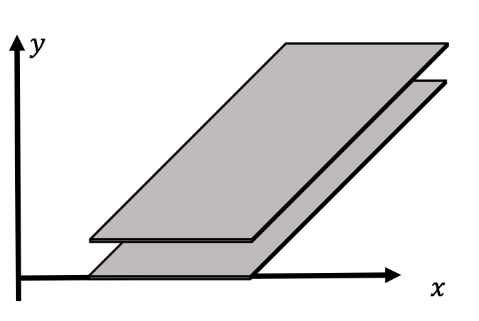

# VP10: Non-ideal Capacitor

這學期程式作業只會有紙本說明，不會有影片講解。但是程式概念不會超出上學期所學，而物理部分則是本學期的內容。

[官方PDF檔](https://drive.google.com/file/d/1nKZOmtCD4nJeACdTGcAEUlqfQBtWzsH6/view?fbclid=IwAR0Go99iGNz__eGYvH6R24zMoOUbSS7OBixKNzaDRCWHZZNsf1FvoMTFp-E)  

> 跟新同學說明一下，上面這是老師提供的 PDF 檔。因為覺得這樣 code 不太好讀，所以我和另一班助教會把作業說明重打成 Markdown 格式（也就是這個檔案了）。

## 作業繳交格式

> 作業檔案請務必照格式上傳（其實上學期還是很多人格式不對，只是我後來死心了就自己手動改...）

請上傳一個zip檔（壓縮檔，請注意副檔名要是zip）到CEIBA，zip檔內需要包含一個**名稱是自己學號的資料夾**，裡面包含一個py檔，取名為 `must.py` 。請記得拍攝說明影片，並**將影片連結寫在video.txt裡面，並一併放入學號資料夾中**。

範例：
```
the_zip_file.zip
└── r07222060
    ├── must.py
    └── video.txt
```


## Deadline

`2019/04/30 Tue 21:00`

## Contents  

+ [Non-ideal Capacitor & Numerical Laplacian Solver](#i-non-ideal-capacitor--numerical-laplacian-solver)  
+ [Homework](#ii-homework)  

## I. Non-ideal Capacitor & Numerical Laplacian Solver
A parallel-plate capacitor, shown in the figure, has an infinite length in z-axis. The distance between the plates is d = 1 mm, the width of both plates is L = 5 mm, and the voltage is 100 Volt on the top plate and -100 Volt on the bottom. If we want to consider the edge effect of the non-ideal capacitor, we need to calculate numerically the total charge on each plate per meter length in z-axis in order to obtain the capacitabce value per meter length in z-axis.

 

> #### 助教註:
> I'm sorry that the readability here is poor due to the numerous equations and the limit of GitHub (Custom CSS is not allowed here). You can go check the PDF file of Professor if you wish.

From General Physics course, we already know that anywhere . Now we choose an infinitesimal cube of volume . In the two faces perpendicular to the x-axis, we have the net electric flux for the two faces as 
.

  

Similiarly the net flux for the two faces perpendicular to y-axis is , and the two faces to z-axis is . Therefore, the total flux around the cube is . If no charge is inside this cube, by Gauss' Law, , meaning . With  , it then becomes , which is called a Laplace's Equation and is usually written as . The operator  is called an Laplacian operator.

Since in this problem, there is no charge variation along the z-axis, by symmetry,  and  everywhere. We can reduce the 3-dimensional Laplace's Equation to 2-dimensonal, . With the condition that at the position of the top and bottom plates  and  respectively, we can try to solve this Laplacian problem by the numerical Laplacian solver. The simplest numerical Laplacian solver is illustrated as the following and starts from the Taylor's expansion:

   

  

We add the above four eqations and will obtain 

because .

Therefore, the potential at each grid-point is simply the mean value of its nearest neighbors. To find the soulution one must fix the values of the grid-points on the boundaries or on the positions according to the required conditions and then iterate the potentials until successive results agree each other to within the desired tolerance. This usually can be done with many enough iterations.

## II. Homework

### MUST

> 助教註: 這次沒有 Optional 部份，所以 Must 部份滿分是 125% 。

In the following program:

1. We use the finite-difference methods for the grid points on the region of interest and set the potential on the top and bottom plates to be .
2. We solve the 2-D Laplace's equation at each grid-point
3. By taking the gradient of the potential, we obtain the electric field on x-y plane.
4. By numerically integrating the Gauss surface, we obtain the total charge on the capacitor.
5. Dividing the total charge by the voltage difference, we obtain the capacitance.

Your job is to complete the template code for **2.**, **4.**, and **5.** and compare the value of **5.** to the value of an ideal parallel-plate capacitor.

(Note: You can change this program easily to calculate the capacitance of a rectangular parallel-plate capacitor, i.e. the length in z is not infinite)

```python
from numpy import * 
from vpython import *

epsilon = 8.854E-12 
N = 101
h = 1E-2/(N-1)
L, d= 5E-3,1E-3
V0 = 200
def solve_laplacian(u, u_cond, h, Niter=5000): 
    V = array(u)
    for i in range(Niter):
        V[u_cond] = u[u_cond]
        V[1:-1, 1:-1] = 0  # replace this 0 by your Laplacian Solver
    return V

def get_field(V, h):
    Ex, Ey = gradient(V)
    Ex, Ey = -Ex/h, -Ey/h 
    return Ex, Ey


u = zeros([N, N])
u[int(N/2)-int(L/h/2.0):int(N/2)+int(L/h/2.0), int(N/2) - int(d/h/2.0)] = -V0/2 
u[int(N/2)-int(L/h/2.0):int(N/2)+int(L/h/2.0), int(N/2) + int(d/h/2.0)] = V0/2 
u_cond = not_equal(u, 0)

V = solve_laplacian(u, u_cond, h)

scene = canvas(title='non-ideal capacitor', height=1000, width=1000, center = vec(N*h/2, N*h/2, 0))
scene.lights = []
scene.ambient=color.gray(0.99)
box(pos = vec(N*h/2 , N*h/2 - d/2 - h, 0), length = L, height = h/5, width = h)
box(pos = vec(N*h/2 , N*h/2 + d/2 - h, 0), length = L, height = h/5, width = h)

for i in range(N):
    for j in range(N):
        point = box(pos=vec(i*h, j*h, 0), length = h, height= h, width = h/10, color=vec((V[i,j]+100)/200,(100-V[i,j])/200,0.0) )

Ex, Ey = get_field(V, h)

for i in range(0, N):
    for j in range(0, N):
        ar = arrow(pos = vec( i*h, j*h, h/10), axis =vec (Ex[i,j]/2E9, Ey[i,j]/2E9, 0), shaftwidth = h/6.0, color=color.black)

#find Q, find C_nonideal = Q/(delta V) 
#Compare C_nonideal to C_ideal
```
 
