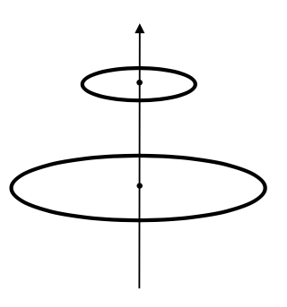
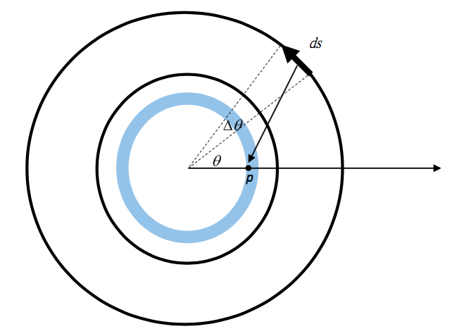

# VP12 Mutual Inductance

## [官方 PDF 檔](VP12.pdf)

## 作業繳交格式

請上傳一個zip檔（壓縮檔，請注意副檔名要是zip）到CEIBA，zip檔內需要包含一個**名稱是自己學號的資料夾**，裡面包含一個py檔，取名為 `must.py` 。請記得拍攝說明影片，並**將影片連結寫在video.txt裡面，並一併放入學號資料夾中**。

範例：
```
the_zip_file.zip
└── r07222060
    ├── must.py
    └── video.txt
```

### Deadline
`06/04 TUE 21:00`

## Homework

There are two circular loops, with radii `R = 12 cm` on `z = 0 cm` plane and `r = 6 cm` on `z = Height = 10 cm` plane. Find the mutual inductance between the two loops by:
(1) Calculating the magnetic flux inside the small loop caused by the current on the large loop
(2) Vice versa.

 

You can do this by your own method (especially by `numpy` array calculation, that would give the results much faster). If you have no clue, you may try the following steps:

 

For part (1):
1. Partition the area inside the small loop into `m` ring areas.
2. Assume the large loop has a current `1A` on it. Cut the large loop into `n` pieces, each with length `ds`.
3. Find the magnetic field at position `p` due to the current on each `ds` by Biot-Savart law.
4. Sum the magnetic field cuased by the source from over all the `n` pieces `ds` along the large loop to get the total magnetic field at `p`.
5. Multiply the magnetic field with the area of the ring area to get the magnetic flux inside that ring area, and sum over all `m` rings to get the total flux inside the small loop due to the current on the large loop.
6. 
7. You can do similarly for part (2).
8. Check if the result of (1) = result of (2).
 
