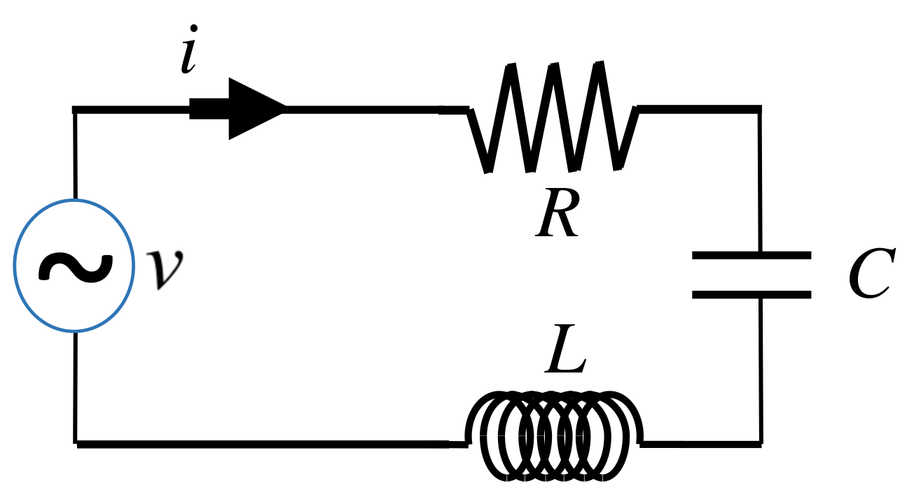

# VP13 RLC and Transient Behavior

[官方PDF檔](VP13.pdf)  

## 作業繳交格式

請上傳一個zip檔（壓縮檔，請注意副檔名要是zip）到CEIBA，zip檔內需要包含一個**名稱是自己學號的資料夾**，裡面包含一個py檔，取名為 `must.py` 。請記得拍攝說明影片，並**將影片連結寫在video.txt裡面，並一併放入學號資料夾中**。

範例：
```
the_zip_file.zip
└── r07222060
    ├── must.py
    └── video.txt
```

## Deadline

`Not determined yet`

## Contents  

+ [I. Introduction](#i-introduction)  
+ [Homework](#ii-homework)  

## I. Introduction

An RLC circuit, with , , . The driving voltage source is


\
where , .



## II. Homework

> 助教註: 這次（其實好像是每次）沒有 Optional 部份，所以 滿分是 125% 。

### (1)

Solve this circuit numerically and plot the voltage  and the current  as a function of  for  in `scene1` and the total energy  stored in the system in `scene2`.

### (2)

You will see a transient behavior of the current  before it reaches a steady-state oscillation around . Find , the amplitude of the oscillating current, and  the phase constant of the oscillating current relative to the voltage source during the 9-th period. Compare them to the theoretical values.

### (3)

After the voltage is turned off at , you will see both the current and the total energy decays. Find the time  such that the energy decays to 10% of the energy at the time the voltage is just turned off, i.e., .

### Template codes

```python
from vpython import *

fd = 120                # 120 Hz
# ===== Add your parameters here =====

t = 0
dt = 1.0 / (fd*5000)    # 5000 simulation points per cycle

scene1 = graph(align='left', xtitle='t', ytitle='i(A) blue, v(100V) red', background=vector(0.6, 0.9, 0.6))
scene2 = graph(align='left', xtitle='t', ytitle='Energy(J)', background=vector(0.6, 0.9, 0.6))

i_t = gcurve(color=color.blue, graph=scene1)
v_t = gcurve(color=color.red, graph=scene1)
E_t = gcurve(color=color.red, graph=scene2)

# ===== Your codes here =====
 
```
