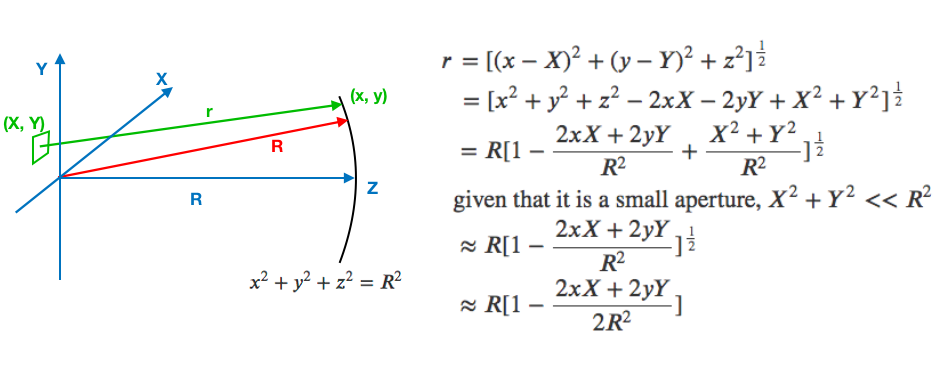
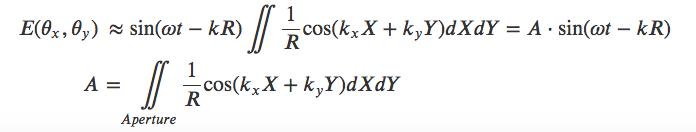

# VP14 Circular Aperture Diffraction

 

\
本次作業不強制完成，採加分方式。前三次作業所佔學期成績將改成 4% ，本次作業最高亦將會加 4% 學期成績。

* [官方PDF檔](VP14.pdf)

## 作業繳交格式

請上傳一個zip檔（壓縮檔，請注意副檔名要是zip）到CEIBA，zip檔內需要包含一個**名稱是自己學號的資料夾**，裡面包含一個py檔，取名為 `must.py` 。請記得拍攝說明影片，並**將影片連結寫在video.txt裡面，並一併放入學號資料夾中**。

範例：
```
the_zip_file.zip
└── r07222060
    ├── must.py
    └── video.txt
```

## Deadline

`2019/06/23 SUN 21:00`

## Homework
This homework is to find the diffraction pattern of a circular aperture far from the screen.

Assume there is a circular aperture of diameter `d = 100 μm` and there is a spherical screen at `R = 1 m` away. The light source is of wavelength `𝜆 = 500 nm`. To obtain the diffraction pattern, you can assume there are many point light sources at the lattice points, sitting at the cross points of the `N = 100` vertical lines and `N = 100` horizontal lines, each separated by `s = d/N = 1 μm` apart. If the lattice point’s position is within the circular aperture, then it is allowed to radiate light. Then on the screen you add all the electric field from the light sources of the grid points and you will be able to obtain the diffraction intensity pattern by squaring the electric field. (The detailed derivation is listed below.)

In addition to (1) generating the intensity plot of the diffraction pattern, also (2) find and print the radius of the first dark ring and check whether the **Rayleigh criterion** `θ = 1.22 𝜆 / d` is satisfied.

Also notice that, to calculate intensity is to do the square of the amplitude. However, the ‘real’ diffraction pattern is really faint to be observed on the computer screen. Therefore, we also do a ‘false’ intensity image of the diffraction pattern by taking the absolute value of the amplitude as the intensity. Of course, when you want to calculate the radius of the first dark ring, you should use the ‘real’ intensity image.

```python
from vpython import *
from numpy import *

N = 100
R, lamda = 1.0, 500E-9
d = 100E-6

dx, dy = d/N, d/N
scene1 = canvas(align='left', height=600, width=600, center=vector(N*dx/2, N*dy/2, 0))
scene2 = canvas(align='right', x=600, height=600, width=600, center=vector(N*dx/2, N*dy/2, 0))
scene1.lights, scene2.lights = [], []
scene1.ambient, scene2.ambient = color.gray(0.99), color.gray(0.99)
side = linspace(-0.01*pi, 0.01*pi, N)
x,y = meshgrid(side,side)

E_field = cos(10000*((x-0.005)**2 + (y- 0.002)**2 )) # change this to calculate the electric field of diffraction of the aperture

Inte = abs(E_field) ** 2
maxI = amax(Inte)
for i in range(N):
    for j in range(N):
        box(canvas=scene1, pos=vector(i*dx, j*dy, 0), length=dx, height=dy, width=dx,
            color=vector(Inte[i,j]/maxI, Inte[i,j]/maxI, Inte[i,j]/maxI))


Inte = abs(E_field)
maxI = amax(Inte)
for i in range(N):
    for j in range(N):
        box(canvas=scene2, pos=vector(i*dx, j*dy, 0), length=dx, height=dy, width = dx,
            color=vector(Inte[i,j]/maxI, Inte[i,j]/maxI, Inte[i,j]/maxI))
```


 

\
The amplitude of the electric field at position (x, y) on the screen gets its contribution from all point source sitting inside the aperture:

 

\
In this problem,  due to the symmetry of the integration on the ‘circular’ aperture. Therefore,

 

\
is the amplitude of the electric field on the spherical screen, which is the one you should calculate by summation over all the grid point on the aperture.
    
